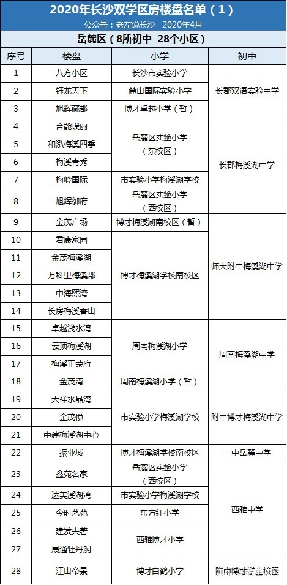

参考https://www.zhihu.com/question/386786492/answer/1150065540
1、长沙目前入学顺位
1）有户有房孩子、父母或其他监护人房屋产权与户籍一致。
2）有户无房孩子户籍在长沙城区，但父母或其他监护人无房产。（孩子、父母户籍一直属于长沙城区）
3）有房无户在长沙购买了房子，但孩子的户口没有迁到房产所在地的。
4）有户无房（第二类）孩子、父母或其他监护人户籍迁入长沙城区，但无房产。5）无户无房孩子、父母或其他监护人是外地户口，且在长沙城区没房。

2、比较关注的学校
长沙市实验小学：八方小区
麓山国际实验小学：恒大华府、钰龙天下佳园、北京御园、枫雅名苑、万象府台
青竹湖湘一外国语小学：只有新房带学位，二手不带

