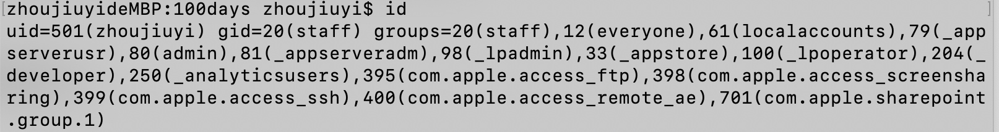

1、绝对路径用什么符号表示？当前目录、上层目录用什么表示？主目录用什么表示? 切换目录用什么命令？
绝对路径用/开头，例如/etc/temp.py
*_当前目录 ./
上层目录 ../
主目录 ~/_*
切换目录 cd 

2、怎么查看当前进程？怎么执行退出？怎么查看当前路径？
查看当前进程 ps
执行退出 exit
查看当前路径 pwd

3、怎么清屏？怎么退出当前命令？怎么执行睡眠？怎么查看当前用户 id？查看指定帮助用什么命令？
清屏 clear
退出当前命令  ctrl+C 彻底退出（退出一直循环执行的指令，例如ping命令）
*_执行睡眠 Ctrl+z将任务中断挂起，可使用fg命令重新启动前台被中断的任务_*
*_查看当前用户id  id_*

查看指定帮助  man ***; ***-help

4、Ls 命令执行什么功能？可以带哪些参数，有什么区别？
ls命令查看指定目录下的内容，包括目录和文件
-a 查看指定目录下的所有文件包括隐藏文件
-l 查看制定目录下文件的详细信息，包括文件大小、权限信息
*_-R：遇到目录要进行递归展开（继续列出目录下面的文件和目录）。
-d：只列出目录，不列出其他内容。
-S / -t：按大小/时间排序。_*
以上参数可以组合使用

5*_、建立软链接(快捷方式)，以及硬链接的命令
软链接：ln -s slink source
硬链接：ln link source_*