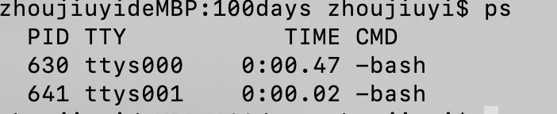
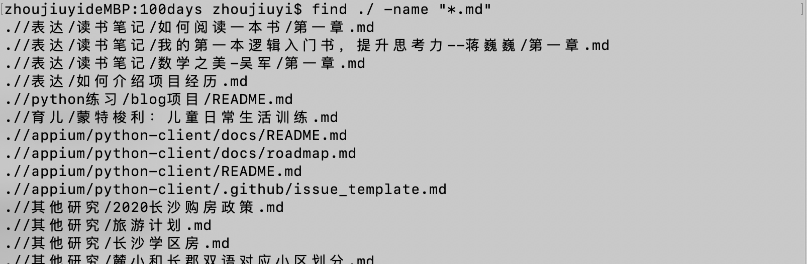
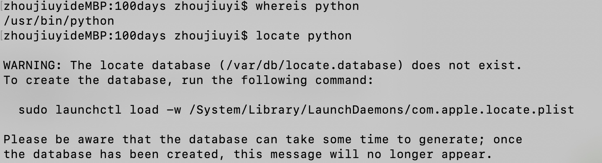
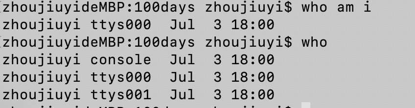
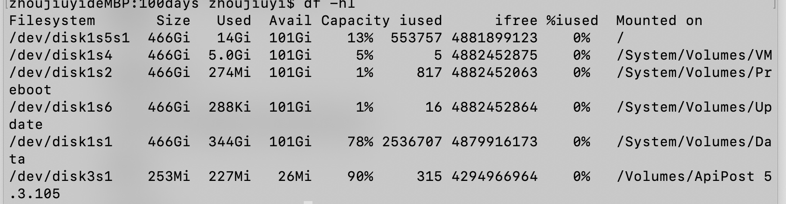
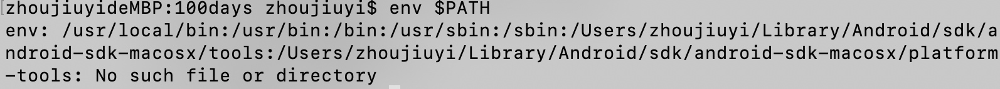

1、绝对路径用什么符号表示？当前目录、上层目录用什么表示？主目录用什么表示? 切换目录用什么命令？
绝对路径用/开头，例如/etc/temp.py
*_当前目录 ./
上层目录 ../
主目录 ~/_*
切换目录 cd 

2、怎么查看当前进程？怎么执行退出？怎么查看当前路径？
查看当前进程 ps


执行退出 exit
查看当前路径 pwd

3、怎么清屏？怎么退出当前命令？怎么执行睡眠？怎么查看当前用户 id？查看指定帮助用什么命令？
清屏 clear
退出当前命令  ctrl+C 彻底退出（退出一直循环执行的指令，例如ping命令）
*_执行睡眠 Ctrl+z将任务中断挂起，可使用fg命令重新启动前台被中断的任务_*
*_查看当前用户id  id_*

查看指定帮助  man ***; ***-help

4、Ls 命令执行什么功能？可以带哪些参数，有什么区别？
ls命令查看指定目录下的内容，包括目录和文件
-a 查看指定目录下的所有文件包括隐藏文件
-l 查看制定目录下文件的详细信息，包括文件大小、权限信息
*_-R：遇到目录要进行递归展开（继续列出目录下面的文件和目录）。
-d：只列出目录，不列出其他内容。
-S / -t：按大小/时间排序。_*
以上参数可以组合使用

5*_、建立软链接(快捷方式)，以及硬链接的命令
软链接：ln -s slink source
硬链接：ln link source_*

6、目录创建用什么命令？创建文件用什么命令？复制文件用什么命令？
目录创建 mkdir
创建文件 *_touch_*、vi、vim创建一个目录下不存在的文件即可

7、文件权限修改用什么命令？格式是怎么样的？
文件权限修改 chmod

```
$ chmod u+x file 给 file 的属主增加执行权限
$ chmod 751 file 给 file 的属主分配读、写、执行(7)的权限，给 file 的所在组分配读、执行(5)的权限，给其他用户分配执行(1)的权限
$ chmod u=rwx,g=rx,o=x file 上例的另一种形式
$ chmod =r file 为所有用户分配读权限
$ chmod 444 file 同上例
$ chmod a-wx,a+r file同上例
$ chmod -R u+r directory 递归地给 directory 目录下所有文件和子目录的属主分配读的权限

```

8、查看文件内容有哪些命令可以使用？
vi、vim直接编辑文件
cat 文件名 查看文件所有内容
more 文件名 逐页加载，按空格键向后翻页，回车键换行
less 文件名 逐页加载，可按b(back)键向前翻页，按空格键向后翻页，回车键换行
tail 文件名  从文件尾部查看文件
head 文件名 从文件头部查看文件

9、怎么向屏幕输出带空格的字符串，比如”hello world”? 
echo 字符串输出
*_echo hello world_*

10、终端是哪个文件夹下的哪个文件？黑洞文件是哪个文件夹下的哪个命令？
*_终端 /dev/tty
黑洞文件 /dev/null_*

11、移动文件用哪个命令？改名用哪个命令？
移动文件:mv 文件名 目录
移动目录:mv 目录 目录
文件重命名:mv 文件名 文件名

12、复制文件用哪个命令？如果需要连同文件夹一块复制呢？如果需要有提示功能呢？
cp 文件名 目录
cp -r 文件/文件名 目录
cp -i 文件名 目录，复制会有覆盖已有文件时有提示，-f则没有，直接覆盖

13、删除文件用哪个命令？如果需要连目录及目录下文件一块删除呢？删除空文件夹用什么命令？
rm 文件名
rm -r 目录
rmdir 删除空文件夹

14、Linux 下命令有哪几种可使用的通配符？分别代表什么含义?
_*“？”可替代单个字符*_
“*”可替代任意多个字符
_*方括号“[charset]”可替代 charset 集中的任何单个字符，如[a-z]，[abABC]*_

15、用什么命令对一个文件的内容进行统计？(行号、单词数、字节数)
_*wc 命令 - c 统计字节数 - l 统计行数 - w 统计字数*_

16、Grep 命令有什么用？如何忽略大小写？如何查找不含该串的行?
grep用来查询文本，能使用正则查询，并把匹配的行标记打印出来

17、Linux 中进程有哪几种状态(STAT)？在 ps 显示出来的信息中，分别用什么符号表示的？
*_（1）、不可中断状态：进程处于睡眠状态，但是此刻进程是不可中断的。不可中断， 指进程不响应异步信号。
（2）、暂停状态/跟踪状态：向进程发送一个 SIGSTOP 信号，它就会因响应该信号 而进入 TASK_STOPPED 状态;当进程正在被跟踪时，它处于 TASK_TRACED 这个特殊的状态。
“正在被跟踪”指的是进程暂停下来，等待跟踪它的进程对它进行操作。
（3）、就绪状态：在 run_queue 队列里的状态
（4）、运行状态：在 run_queue 队列里的状态
（5）、可中断睡眠状态：处于这个状态的进程因为等待某某事件的发生（比如等待 socket 连接、等待信号量），而被挂起
（6）、zombie 状态（僵尸）：父亲没有通过 wait 系列的系统调用会顺便将子进程的尸体（task_struct）也释放掉
（7）、退出状态_*

用ps aux格式能看到STAT进程的状态
```
D 不可中断 Uninterruptible（usually IO）
R 正在运行，或在队列中的进程
S 处于休眠状态
T 停止或被追踪
Z 僵尸进程
W 进入内存交换（从内核 2.6 开始无效）
X 死掉的进程
```

18、怎么使一个命令在后台运行?
*_一般都是使用 & 在命令结尾来让程序自动运行。(命令后可以不追加空格)
_*

19、利用 ps 怎么显示所有的进程? 怎么利用 ps 查看指定进程的信息？
ps -ef（标准格式）
ps aux (bsd格式)
ps -ef |grep pid

20、哪个命令专门用来查看后台任务?
*_jobs_*

21、把后台任务调到前台执行使用什么命令?把停下的后台任务在后台执行起来用什么命令?
将后台进程置于前台 - fg
让进程在后台继续运行 - bg

22、终止进程用什么命令? 带什么参数?
kill-9 pid

23、怎么查看系统支持的所有信号？
*_kill -l_*

24、搜索文件用什么命令? 格式是怎么样的?
find <指定目录> <指定条件> <指定动作>,find 直接搜索磁盘，较慢

还有
whereis 加参数与文件名
locate 只加文件名,locate是在系统数据库中查找，由updatedb程序来更新


25、查看当前谁在使用该主机用什么命令? 查找自己所在的终端信息用什么命令?
查找自己所在的终端信息：who am i
查看当前谁在使用该主机：who


26、使用什么命令查看用过的命令列表?
history

27、使用什么命令查看磁盘使用空间？空闲空间呢?
df -hl


28、使用什么命令查看网络是否连通?
netstat

29、使用什么命令查看 ip 地址及接口信息？
ifconifg

30、查看各类环境变量用什么命令?
查看所有环境变量 env
查看某个环境变量 path：env $PATH


31、通过什么命令指定命令提示符?
\u：显示当前用户账号
\h：显示当前主机名
\W：只显示当前路径最后一个目录
\w：显示当前绝对路径（当前用户目录会以~代替）
$PWD：显示当前全路径
\$：显示命令行’$'或者’#'符号
\#：下达的第几个命令
\d：代表日期，格式为week day month date，例如："MonAug1"
\t：显示时间为24小时格式，如：HH：MM：SS
\T：显示时间为12小时格式
\A：显示时间为24小时格式：HH：MM
\v：BASH的版本信息 如export PS1=’[\u@\h\w\#]\$‘

32、查找命令的可执行文件是去哪查找的? 怎么对其进行设置及添加?
whereis python

33、通过什么命令查找执行命令?
which 只能查可执行文件
whereis 只能查二进制文件、说明文档，源文件等

34、怎么对命令进行取别名？
alias la='ls -a'

35、du 和 df 的定义，以及区别？
du 显示目录或文件的大小

df 显示每个<文件>所在的文件系统的信息，默认是显示所有文件系统。
（文件系统分配其中的一些磁盘块用来记录它自身的一些数据，如 i 节点，磁盘分布图，间接块，超级块等。这些数据对大多数用户级的程序来说是不可见的，通常称为 Meta Data。） du 命令是用户级的程序，它不考虑 Meta Data，而 df 命令则查看文件系统的磁盘分配图并考虑 Meta Data。
df 命令获得真正的文件系统数据，而 du 命令只查看文件系统的部分情况。

36、怎样一页一页地查看一个大文件的内容呢？
cat file_name.txt | more
