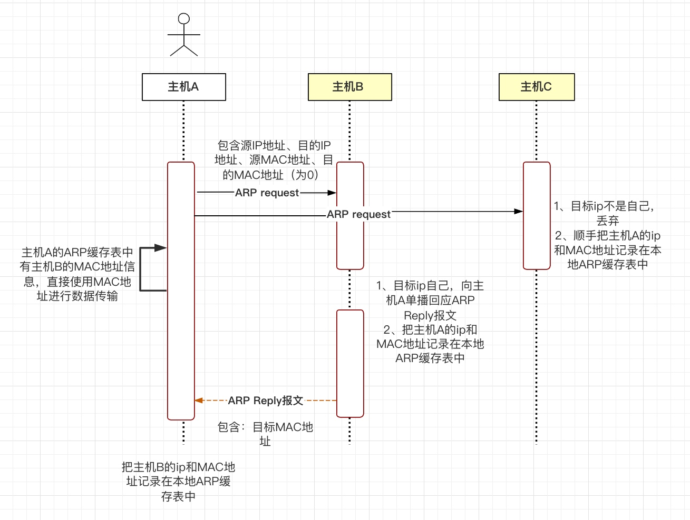

# 网络基础

### ARP
一台主机要发送数据给另一台主机时，必须要知道目标主机的网络层地址（ip地址），但仅有ip地址是不够的，ip数据报文必须要封装成帧，才能通过数据链路层发送。数据帧必须包含目的MAC地址，因此发送端必须得到目的MAC地址。
通过ARP协议可以根据ip地址获取对方的MAC地址。
**ARP的工作机制**
假设主机A需要给主机B发送数据

### TCP
TCP 是面向连接的,提供端到端可靠性服务的传输层协议，用于为应用层提供服务，通过端口号可以唯一标识一个应用。
TCP的报文格式，如下图

1、16位源端口号：源主机的应用程序使用的端口号。
2、16位目的端口号：目的主机的应用程序使用的端口号。
根据源端口号、目的端口号、ip头部中源ip地址和目的ip地址可以唯一确定一个TCP连接。
3、32位序列号：用于标识从发送端发出的不同的TCP数据段的序号。可以解决网络包乱序问题。
数据段在网络中传输时，它们的顺序可能会发生变化；接收端依据此序列号，便可按照正确的顺序重组数据。
4、32位确认序列号：用于标识接收端确认收到的数据段。确认序列号为成功收到的数据序列号加1。用来解决不丢包的问题。
5、4位头部长度：表示头部占32bit字的数目，它能表达的TCP头部最大长度为60字节。
6、6位标志位：
URG：紧急指针是否有效。它告诉系统此报文段中有紧急数据，应尽快传送（相当于高优先级的数据），而不要按原来的排队顺序来传送。当URG置为1时，发送应用进程就告诉发送方的TCP有紧急数据要传送。
ACK：表示确认号是否有效，携带ack标志的报文段也称确认报文段，仅当ACK=1时确认号字段才有效。当ACK=0时，确认号无效。TCP规定，在连接建立后所有的传送的报文段都必须把ACK置1。
PSH：提示接收端应用程序应该立即从tcp接受缓冲区中读走数据，为后续接收的数据让出空间。
RST：表示要求对方重建连接。带RST标志的tcp报文段也叫复位报文段。
SYN：表示建立一个连接，携带SYN的tcp报文段为同步报文段。在连接建立时用来同步序号。
FIN标志：表示告知对方本端要关闭连接了。用来释放一个连接。
7、16位窗口大小：表示接收端期望通过单次确认而收到的数据的大小。由于该字段为16位，所以窗口大小的最大值为65535字节，该机制通常用来进行流量控制。
8、16位校验和：校验整个TCP报文段，包括TCP头部和TCP数据。该值由发送端计算和记录并由接收端进行验证。
9、16位紧急指针：是一个正的偏移量。它和序号字段的值相加表示最后一个紧急数据的下一字节的序号。因此这个字段是紧急指针相对当前序号的偏移量。发送紧急数据时会用到这个。
10、选项：长度可变，最长可达40字节。当没有使用“选项”时，TCP的首部长度是20字节。