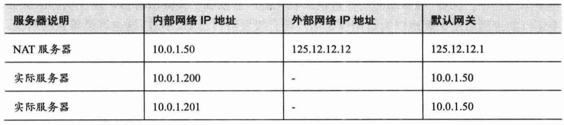

# 负载均衡
负载均衡怎么理解？
不能狭义的理解为分配给所有实际服务器的工作量一样多，因为有时候，多台服务器的承载能力各不相同，这可能体现在硬件配置、网络带宽的差异，也可能因为某台服务器身兼多职，我们所说的“均衡”，也就是希望所有服务器都不要过载，并且能够最大程度地发挥作用。
* 单点故障：通常分布式系统采用主从模式，一个主机连接多个处理节点，主节点负责分发任务，而子节点负责处理业务，当主节点发生故障时，会导致整个系统发故障，我们把这种故障叫做单点故障。
* 高可用性（HA）:指的是通过尽量缩短因日常维护操作（计划）和突发的系统崩溃（非计划）所导致的停机时间，以提高系统和应用的可用性。
* 
## HTTP重定向
HTTP重定向具备了请求转移和自动跳转的本领，可以用于实现负载均衡，以达到web扩展的目的。重定向由HTTP代理和web服务器共同实现。
可以在代码配置跳转的location，采用随机选取配置的location进行跳转。
为什么不用轮询的重定向策略：1）HTTP本是无状态的，要实现按顺序转移请求，势必要将最后一次转移到的服务器编号进行保存，这将会带来一定开销；2）要实现顺序转移，就会要记录转移状态，而转移状态是一个互斥资源，转发程序必须要通过一定的锁机制来保障只有一个请求可以修改它，这将会影响请求转移计算的并发性。

## DNS负载均衡

当访问站点时，首先需要该站点域名的DNS服务器获取域名对应的ip地址，DNS服务器完成了域名到ip的映射，可以是一对多的，这个时候DNS服务器充当了负载均衡调度器的角色。

DNS服务软件通常提供丰富的调度策略供你选择，其中最常用的就是根据用户IP来进行智能解析，可以再所有可用的A记录中寻找里用户最近的一台服务器。

故障转移：当一台服务器出现故障时，如何自动监测到故障并第一时间修改DNS记录，且修改后能够及时生效。动态DNS可以实现，每次IP地址变更时可以及时地更新DNS服务器。

## 反向代理负载均衡
反向代理负载均衡器，对于HTTP请求的调度体现在转发上，前面所说的两种是转移。这意味着：
* 任何对于实际服务器的HTTP请求都必须经过调度器
* 调度器必须等待实际服务器的HTTP响应，并将它反馈给用户。

反向代理服务器对于所有HTTP请求都需要亲自转发，当后端服务器处理时间较少时，反向代理服务器转发的开销成为影响性能的瓶颈，所以当反向代理服务器的吞吐率接近极限时，再添加后端服务器都是无济于事的。对于这种情况，基于DNS的负载均衡方式会更合适。

**健康监测**：反向代理服务器可以监控后端服务器的很多方面，比如系统负载、响应时间、是否可用、TCP连接数、流量等，它们都是负载均衡调度策略需要考虑的因素。

Nginx 反向代理模块：ngx_http_proxy_module、ngx_http_upstream_module 后端检测模块：nginx_http_upstream_check_module

有了健康监测，在出现错误的时候，调度器会放弃已关闭服务的后端服务器，且可以部署一定数量的备用后端服务器，当某些后端服务器出错时备用机器可以接替，保障整体的性能。

**黏滞会话：**
背景：当负载均衡采用RR（轮询调度算法）调度策略时，即使是同一用户对同一内容的多次请求，可能被转发到了不同的后端服务器，可能会带来一些问题，例如：
* 后端服务器启用了session来本地化保护用户的一些数据，下次用户请求如果转发给了其他服务器就会丢失这些session数据，导致无法访问；
* 后端服务器实现的动态缓存内容，在这种无规律的转发使得这些缓存的利用率下降。
问题1：RR调度策略为什么会使毫无规律的转发？不是按顺序轮流来的吗
如何解决:让用户在一次会话周期内的所有请求始终转发到一台特定的后端服务器上，这种机制也称为黏滞会话。
1）可以通过ip地址作为识别标志，对用户ip进行hash计算三列到不同的后端服务器上。
2）可以吧后端服务器编号通过调度器追加到用户的cookies中去。
规避这种情况：使用黏滞会话多少会破坏均衡策略，所以要尽可能避免在后端服务器保存session数据和本地化缓存，采用分布式session或分布式缓存等设计来代替。

## ip负载均衡
背景：前面已经了解了应用层的几个负载均衡调度器的工作机制，各有弊端，HTTP重定向当用户不是从主站点进入时，可以绕过重定向策略；反向代理负载均衡本身开销就严重制约了服务器的扩展。能否在HTTP层面一下实现负载均衡？
**DNAT**
NAT:网络地址转换，可以让用户身处内部网络却与互联网建立通信
DNAT:"反向NAT"，将实际服务器放在内网，作为网关的NAT服务器将来自用户端的数据包转发给内部网络的实际服务器。它需要修改数据包的目标地址和端口。
问题1：了解NAT的工作原理
https://blog.csdn.net/hzhsan/article/details/45038265
NAT是一种把内部私有网络地址（IP地址）翻译成合法网络IP地址的技术。
问题2：DNAT的工作原理

NAT工作原理：
硬件配置：
NAT服务器的两块网卡分别连接外部网络和内部网络
有两台与NAT服务器同在一个内部网络的实际服务器
用户端IP：202.20.20.20

1）用户端通过DNS服务器得知站点ip
2)用户端向站点ip发送IP数据包，数据包的来源ip为202.20.20.20:6584、目标ip为125.12.12.12:80
3)当数据包到达125.12.12.12的内核缓冲区后，NAT服务器选择一台实际服务器把数据包传给10.0.1.201的服务器进程中进行处理，具体来说是，NAT服务器将刚刚收到的数据包进行修改，将目标ip改为10.0.1.201:8000，接下来NAT服务器内部网卡将该数据包投递到内部网络中，根据IP层寻址机制，数据包就会传入10.0.1.201这台服务器
4）在10.0.1.201服务器上处理完数据后，将包含结果数据的响应数据包投递到内部网络，来源ip为10.0.1.201:8000，目标ip为202.20.20.20:6584，由内网传到外网必须要经过NAT服务器，先到达默认网关，修改来源ip为125.12.12.12:80
5）最终，数据包传回给用户端
问题3：“用户空间的进程”是什么意思？
> 当数据包到达125.12.12.12 的内核缓冲区后，NAT服务器并没有把它交给用户空间的进程去处理，而是挑选了一台实际服务器，这里恰好为10.0.1.210

netfilter模块：可以进行网络地址转换（NAT）、修改ip数据包、改变路由规则、数据包过滤等
iptables：工作在用户空间的命令行工具，可以通过iptables来操作netfilter模块

ipvs：实现基于NAT的负载均衡、直接路由、ip隧道等负载均衡。
ipvsadm：ipvs对应的命令行工具

调度策略
静态调度策略：前面常说的RR轮询调度策略，以及带权重的RR调度策略都属于静态调度策略
动态调度策略：ipvsadm提供的一系列动态调度策略，例如最小连接（LC)、带权重的最小连接（WLC）、最短期望时间延迟（SED）等，它们都可以根据实际服务器的各种实时状态做出调度决策。

网关瓶颈
当实际服务器较多，且响应数据流量较大时，来自多个服务器的响应数据包有可能在NAT服务器中发生拥堵。
1）为NAT服务器使用万兆网卡，并为内网使用万兆位交换机。
2）将基于NAT的集群和前面的DNS-RR混合使用，可以组建多个条件允许的NAT集群。
3）直接路由负载均衡

## 直接路由
直接路由下的负载均衡调度器工作在数据链路层，通过修改数据包的目标MAC地址，将数据包转发到实际服务器上，实际服务器的响应数据包将直接发送给用户端，而不需要经过调度器。

ip别名
一个网络接口（物理网卡eg:eth0、虚拟接口eg:回环网络接口lo）对应一个ip地址，但除此之外，还可以为它配置更多个ip地址，它们称为ip别名。
一个网络接口最多可以设置256个ip别名。