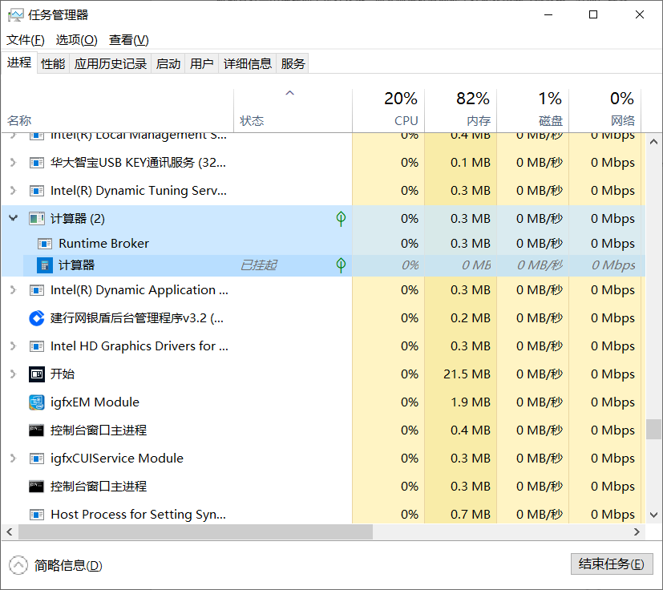

**进程**
1、进程的调度是由内核来进行，目的是分配系统资源的实体。

2、每个进程都有自己独立的内存地址空间和生命周期，但是每个进程都只能共享CPU寄存器。

3、在繁忙的服务器上频繁的创建进程，其开销可能成为影响性能的主要因素。

在项目中有个案例，开发写代码时在函数里创建了进程，但函数执行完后未关闭进程，线上运行时用户触发了一个错误，一直连续请求这个函数，结果就是导致整个服务崩溃。

问题1：什么是I/O操作？
回答：将数据读入内存或者内存输出的过程
常见的I/O流操作，一般说的是【内存】与【磁盘】之间的输入输出。

问题2：下文中什么是上下文信息？什么是上下文切换？

> 为此，在 Linux 2.0之后，提供了对轻量级进程的支持，它由一个新的系统调用clone()来创建，并由内核直接管理，像普通的进程一样独立存在，各自拥有进程描述符，但是这些进程已经允许共享一些资源，比如地址空间、打开的文件等。轻量级进程减少了内存的开销，并为多进程应用程序的数据共享提供了直接支持，但是其上下文切换的开销还是在所难免的。

问题3：如何理解下面这段话，实例是什么意思？运行到什么程度是用什么形式展示，百分比吗？

> 进程也可以理解为记录程序实例当前运行到什么程度的一组数据，多个进程通过不同的进程描述符与这些数据进行关联。

**线程**

1、从内核的角度来看，多线程只是一个普通的进程，它是由用户态通过一些库函数模拟实现的多执行流，所以多线程的管理完全在用户态完成。

2、这种方式下线程切换开销比进程和轻量级进程都要少一些，但它在多处理器的服务器中表现差。

问题1：线程和进程的关联和区别是什么？
问题2：用户态是什么？

**进程调度器**

背景：在单CPU的机器上，虽然看起来是很多任务在同时运行，但从微观角度，任何时刻都只有一个进程在运行，其他进程有的被挂起等待状态，有的已经就绪并等待CPU时间片，还有其他状态。

1、内核中进程调度器维护着各种状态的进程队列。

2、另一个重要工作是决定下一个运行的进程。每个进程需要告诉进度调度器自己的紧急程度，被称为**进程优先级**。优先级除了进程自己决定，进程调度器在运行时也会动态调整它们的优先级。

优先级所代表的值就是进程调度器分配给进程的时间片长度。

问题1：fastcgi进程是什么？为啥要将fastcgi进程作为样本与lighttpd进行比较？

**系统负载**

单位时间内运行队列中就绪等待的进程数平均值。

**进程切换**

1、进程切换：为了让所有的进程可以轮流使用系统资源，进程调度器在必要的时候挂起正在运行的进程，同时恢复以前挂起的某个进程，这种行为称为进程切换，也就是我们常说的“上下文切换”，这个名称在某种意义上非常形象，“上下文”正是表示进程运行到何种程度。

2、进程挂起和进程恢复：一个进程被挂起的本质就是将它在<u>CPU寄存器</u>中的数据拿出来暂存在<u>内核态堆栈</u>中，而一个进程恢复工作的本质就是将它的数据重新装入CPU寄存器。

3、如果我们希望服务器支持较大的并发数，那么就尽量减少上下文切换次数。

问题1：如何理解下文中硬件上下文、进程上下文

>一个进程被挂起的本质就是将它在<u>CPU寄存器</u>中的数据拿出来暂存在<u>内核态堆栈</u>中，而一个进程恢复工作的本质就是将它的数据重新装入CPU寄存器，这段装入和移出的数据称为“硬件上下文”，它也是进程上下文的一部分。除此之外，进程上下文中还包含了进程运行时需要的一切状态信息。

**IOWait**
指CPU空闲并且等待I/O操作完成的时间比例。

**锁竞争**
一般采用【锁】机制来控制资源的占用，当一个任务占用资源时，我们锁住资源，这是其他任务都在等待锁的释放，这种现象称为锁竞争。
在实际项目中遇到过同一张线索被多个玩家同时搜到的缺陷，后面通过增加分布式锁机制来解决该问题。

 **查看进程的命令记录**

- 查看系统负载情况

top或者w工具

- 查看运行队列情况

cat /proc/loadavg

- linux性能监视工具Nmon

- linux压力测试工具ab
